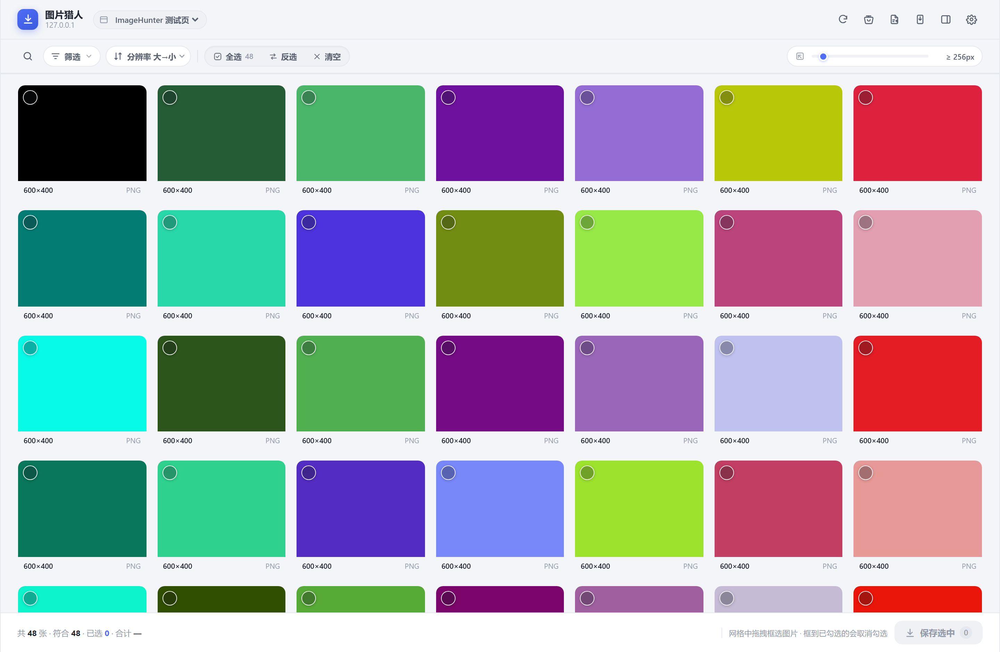
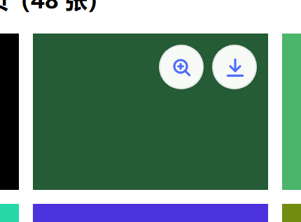
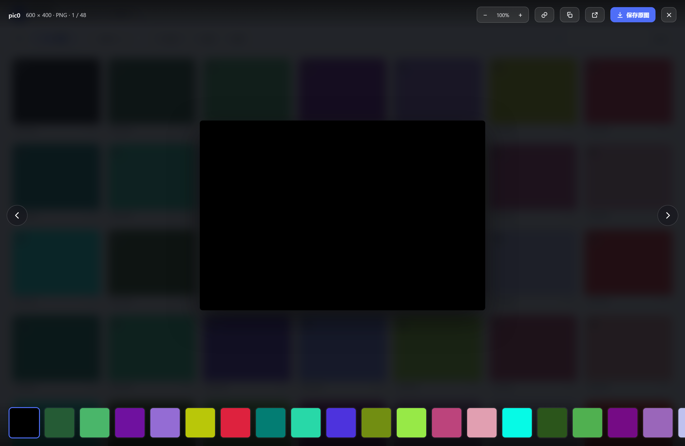
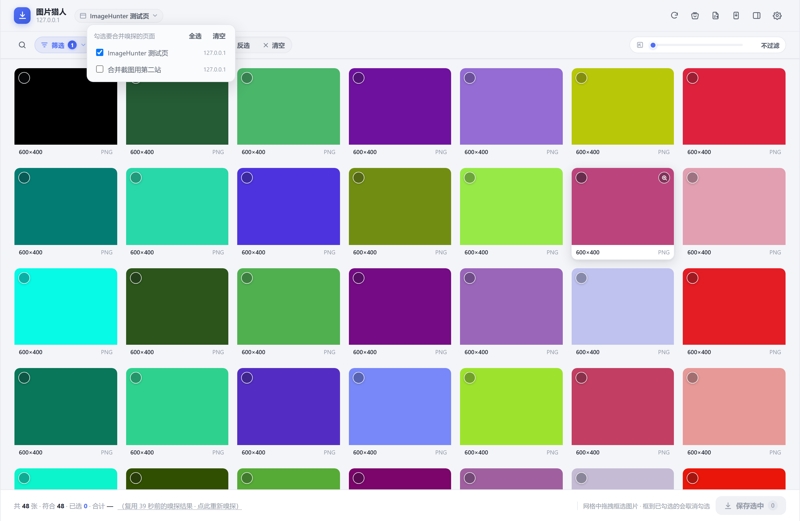

# ImageHunter

**Find every image on a web page — filter it down, batch-download it, and always get the original.**

A **Chrome / Edge** browser extension (Manifest V3).
**Zero dependencies, zero build** — clone the repo, point "Load unpacked" at this directory, and it runs.
No `npm install`, no build step.

**English** | [中文](README.md)

📖 **[Full handbook (中文)](HANDBOOK.md)** — feature details · usage · technical notes · 24 FAQs · full version history
🧪 **[Testing notes (中文)](tests/README.md)** — 1,511 assertions · 23 traps where "the tests lie to themselves"
🗺️ [Roadmap](ROADMAP-2026-09-29.md) · 🔍 [Code audit](AUDIT-2026-09-28.md) · 📋 [Status review](REVIEW-2026-10-08.md)

<table>
  <tr>
    <td width="50%"><br><sub>Gallery: results + filters + batch save</sub></td>
    <td width="50%"><br><sub>Hover: preview / download in place</sub></td>
  </tr>
  <tr>
    <td width="50%"><br><sub>Lightbox: page through images without leaving the tab</sub></td>
    <td width="50%"><br><sub>Merged multi-tab scan (optional, off by default)</sub></td>
  </tr>
</table>

---

## What problem does it solve

The browser's "Save image as…" has three long-standing pains:

1. **You get the thumbnail.** Many sites serve `xxx-300x200.jpg` on listing pages, and right-click → save gives you exactly that small one.
2. **Saving one by one is slow.** Dozens of images per page — right-click → Save as → pick a folder → save, dozens of times.
3. **You can't find them afterwards.** The filenames are `image (1).jpg`, `image (2).jpg`, … all dumped into your Downloads folder.

ImageHunter solves all three at once: **scan the whole page → filter → select → batch download**,
and at every step it guarantees you get "the largest original that can be obtained".

---

## Core features

### 1. Hover to save the original

Move the mouse over any image and a small pair of round buttons appears in the top-right corner
(left: magnifier preview, right: download arrow). Click download to save the original directly —
no more right-click menu. The icons follow scrolling in real time and disappear when the mouse leaves.

- The download button has **four states**: idle → saving (spinner) → success (green check) → failed (red exclamation, click to retry)
- The download button **always stays at the image's top-right**; the preview button grows out to the left —
  returning users' muscle memory never gets moved around
- `Alt + click` an image saves it without hovering first; the context menu also has "Save this image (original)"

### 2. Full-page scan → gallery

Click the extension icon to open the full gallery **in a new tab** (not a small popup).
It automatically locks onto the tab you were just viewing as the scan target; the dropdown at the top
lets you switch targets at any time, and switching re-scans.

- **11 source types**: ``, `srcset`, `<picture>`, lazy-load attributes (`data-src` etc.), CSS background images,
  pseudo-element backgrounds, `video poster`, inline SVG, linked images, `preload`, `og:image` — **including all iframes**
- **Multi-dimensional filtering**: resolution presets (≥800 / ≥1200 / ≥1920 / ≥2560), a continuous minimum-size slider (0–4096px, **default 256**),
  aspect ratio, format, source, keyword search
- **Sorting**: resolution / file size / page order / site
- **Batch actions**: drag-select, select all, clear, batch save; the top bar shows "N selected · X MB total" live

### 3. Guaranteed original — a three-layer mechanism

This is the project's most important piece of engineering:

1. **Pick the largest from `srcset`** — parses the `w` / `x` descriptors of `` and `<picture><source srcset>`, takes the largest
2. **Thumbnail URL restoration** — built-in rules cover: WordPress size suffix (`image-1024x768.jpg` → `image.jpg`),
   path size segments (`/w_400/`, `/300x200/`, `/thumbs/`), query params (`?w=400&h=300&q=80`),
   Cloudinary, Qiniu, Alibaba Cloud OSS, Baidu Cloud CDN, Upyun, Taobao CDN, …
3. **Measured selection (the key safeguard)** — every restored candidate URL is **actually loaded and verified**;
   it is only adopted if it **loads successfully and has a genuinely larger pixel area**, otherwise it falls back to the original URL.
   This structurally prevents "turning a good link into a broken one"

> The whole restoration round has an **8-second time budget**. Images that don't make it keep the thumbnail URL from the page
> (the status bar says so honestly). Each such card has a "Restore" button in the bottom-right corner to retry that one image.

### 4. Full-size preview viewer

Click the magnifier in the hover buttons to open a full-screen lightbox **in place** — it won't throw you into another tab.
`←` `→` to page through, `Esc` to close; the lightbox top bar also has "Open in gallery".

### 5. Keyboard accessible + screen-reader accessible

The gallery grid is a standard multi-select list (`role="listbox"` + `role="option"`), and you can complete
the whole "pick → save" path from the keyboard:

| Key | Action |
|---|---|
| `Tab` | Enter / leave the grid (**the whole grid is a single Tab stop**) |
| `←` `→` `↑` `↓` | Move focus between cards |
| `Home` / `End` | Jump to the first / last card |
| `PageUp` / `PageDown` | Page by visible height |
| `Enter` / `Space` | Toggle the current card |
| `P` | Open the full-size preview |
| `R` | Retry the images that failed to restore |

Under the hood: **roving tabindex** (2,000 cards don't become 2,000 Tab stops),
hover buttons must be visible on focus (fixes WCAG 2.4.7), and state changes are announced via `aria-live` with a 180ms debounce.

### 6. Other things worth mentioning

| Feature | Description |
|---|---|
| **Deep scan** | Scrolls the whole page and collects as it goes, so infinite-scroll sites that only load at the bottom are fully captured |
| **Merged multi-tab scan** | Optional switch, off by default. Check several open pages and merge them into one list, deduped by URL across pages, each image labelled with its source page |
| **Size probing** | Sends a `HEAD` per image (falls back to `Range: bytes=0-0`), reads only `Content-Length`, so you can sort by size without downloading the body |
| **Scan result cache** | Same tab and same URL — reopening the gallery within 5 minutes reuses the result; the status bar honestly notes "reusing scan from N minutes ago" |
| **Export list** | Left-click exports JSON, right-click exports CSV (filename / dimensions / size / format / source / restored? / URL) |
| **Subfolder by site or date** | Templates `{host}` / `{date}` / `{index}` — batch-downloading hundreds of images won't all pile up in Downloads |
| **Site blocklist** | For sites you don't want to be bothered on (online banking, web editors), hover buttons are hidden and shortcuts don't respond there |
| **Custom restore rules** | Write regexes in the options page, with a **rule debugger** (paste a URL to see which candidates it generates, whether they load, and whether they'd be adopted) |
| **Three global shortcuts** | `Alt+Shift+S` in-page panel / `Alt+Shift+G` open gallery / `Alt+Shift+D` save the currently hovered image |
| **Self-service diagnostics bundle** | One click in the options page exports JSON. **Aggregate numbers and hostnames only** — no image URLs, page URLs, or file paths |
| **Chinese / English UI** | Switchable at runtime in the options page ("Interface language": follow browser / 中文 / English). Default follows the browser language |
| **Customisable theme** | Light / dark / follow-system, six colour schemes (Indigo · Teal · Emerald · Rose · Amber · Slate), or pick any accent colour with the colour picker. Change it once and the gallery, the in-page panel and the lightbox accent colour **all** follow |
| **UI gets out of the way** | Every top-bar action stays visible and one click away, but the faux-3D gradients are gone; the filter bar is collapsed by default and cards have no border unless hovered — so you see a wall of images first, not a ring of toolbars |

---

## Install

### Option 1: Load as an unpacked extension (recommended)

1. Clone or download this repository
2. Open `chrome://extensions/` (or `edge://extensions/` on Edge)
3. Turn on **Developer mode** in the top-right
4. Click **Load unpacked** and select this directory
5. The extension icon appears in the toolbar (if not, click the puzzle icon and pin "ImageHunter")

> After changing code, click the **reload** button on the extension card to apply it.

### Option 2: Build a zip

```bash
node tools/package.js          # → dist/image-hunter-v<version>.zip
node tools/package.js --list   # just list the files that would be packed
```

Zero dependencies (compression uses Node's built-in zlib). The packaging whitelist is **derived recursively from `manifest.json`**,
not hand-written — hand-written lists rot: you add a file, forget to list it, and ship a broken package that
**only shows up after a user installs it**. Timestamps are fixed, so the same source always produces a **byte-identical** zip (reproducible build).

### Permissions

| Permission | Purpose |
|---|---|
| `downloads` | Save images to the browser's default download folder |
| `storage` | Store settings, download history, dedup fingerprints |
| `contextMenus` | Image / page context menus |
| `scripting` | Re-inject content scripts into already-open pages |
| `<all_urls>` | Scan images on any website (including iframes) — an inherent requirement of the core capability |

The extension **collects and uploads no data**; all settings / history / fingerprints stay on your machine.

---

## Quick start

1. Open any page with images
2. **Save one** — move the mouse over an image and click the download arrow in the top-right
3. **Save a batch** — click the toolbar icon to open the gallery → drag the slider / search keywords to narrow down → select → click "Save"
4. **Want the original** — that's the default. Cards with a "Restore" button in the corner are the ones that didn't finish restoring this round; click it to retry that one

> The size slider **starts at 256** when the gallery opens, so small icons with a short side under 256px won't appear —
> this is not a scan miss. To see everything, drag the slider to `0`.

---

## Project structure

```
image-hunter/
├── LICENSE                # AGPL-3.0
├── manifest.json          # MV3 manifest
├── background.js          # Service Worker: download queue, message routing, history/fingerprints, size probing
├── shared/                # Message constants, URL utils, storage wrapper, i18n, diagnostics (pure functions)
├── content/               # Content scripts: scan engine, hover buttons, lightbox, in-page panel
├── popup/                 # Gallery UI (a standalone page; the in-page panel shares the same code)
├── options/               # Options page
├── tools/                 # Packaging, settings audit
├── tests/                 # 17 Node suites + 28 real-browser suites
├── docs/screenshots/      # UI screenshots
├── _locales/              # Only extension name/description/command titles/context-menu strings (serves the manifest); the UI itself is handled by shared/i18n.js
└── icons/
```

For the full directory tree (with each file's responsibility) see [HANDBOOK.md](HANDBOOK.md#目录结构).

---

## Development

```bash
npm ci                 # first time: install dev dependencies (jsdom + playwright-core)
npm test               # Node suites (17)
npm run test:browser   # real-browser suites (28, needs a local Edge / Chrome)
npm run test:all       # run both entry points
npm run package        # build the zip
npm run audit:settings # audit settings: list every setting's read site / UI hook to find dead settings
```

- **The extension itself is zero-dependency and zero-build.** Everything declared in `package.json` is a **dev-time** dependency and is not packed into the extension
- The browser suites need a **full** Chromium installed the first time (the headless shell doesn't support `--load-extension`):
  `npx playwright-core install --with-deps --no-shell chromium`
- Currently measured: Node **16 suites / 834 assertions**, real browser **26 suites / 677 assertions** — **1,511** in total, all green
- CI lives in [`.github/workflows/ci.yml`](.github/workflows/ci.yml): both entry points run on `push` / `pull_request`,
  and neither job allows `continue-on-error` — a check that fails but is ignored is worse than no check at all

> **The most valuable thing about the tests isn't the count — it's the 22 traps in [`tests/README.md`](tests/README.md).**
> Wrong assertion premises, static guards matching their own comments, a hand-written list missing an entry without failing,
> asserting on an intermediate result as if it were final… Each trap comes with a criterion and a remedy.
> That document explains this project's standard for "trustworthy conclusions" better than the tests themselves.

---

## Technical notes

- **Zero build, zero dependency** — native ES2020; no npm / webpack / bundler, load it and it runs
- **Shadow DOM isolation** — all in-page UI is encapsulated in a Shadow DOM; site CSS can't touch it and it can't touch the site
- **Multi-iframe aggregation** — content scripts are injected into all frames, each scans independently, and the background merges and dedupes
- **MV3 sleep handling** — downloads are handed to the browser `downloads` API; the queue is persisted to `storage.session`,
  so unfinished downloads recover automatically after the Service Worker is reclaimed
- **Concurrency limiting** — both size probing and downloading have concurrency gates, so pages aren't dragged down no matter how many images there are
- **Reproducible packaging** — fixed timestamps; the same source always produces a byte-identical zip
- **LF line endings everywhere** — pinned by `.gitattributes`; otherwise "two builds produce identical bytes" mysteriously goes red on another machine

---

## FAQ

**Q: Some small images don't show up after opening the gallery — did the scan miss them?**
No. The lower slider in the "Size" cell of the filter bar **starts at 256**, so anything with a short side under 256px is filtered out.
The badge to the right of the slider and on the "Filter" button shows the number of active conditions in real time. To see everything, drag the slider to **0**.

**Q: Is there an English UI?**
Yes. The UI supports **Chinese / English switching at runtime**: the "Interface language" control in the options page offers
Follow browser / 中文 / English, and the default follows the browser's language. The switch takes effect immediately —
open gallery tabs update on the spot, no reload needed. The `_locales/` directory still exists, but only for the 8 strings the
browser renders natively (extension name / description / command titles / context-menu text); all actual UI text comes from
`shared/i18n.js`. Want to add a third language? The two language tables are checked for parity by the test suite.

**Q: Some images fail to save?**
A few sites have strict hotlink protection. The extension automatically tries a fallback (fetching via the extension page); if that still fails,
right-click the image and choose "Open original in a new tab" to save it manually.

**Q: Why doesn't an image show the hover download icon?**
By default, images smaller than 64px don't get an icon (to avoid small icons and separators getting in the way).
You can lower the "minimum display size" in the options page.

**Q: I clicked download and it said "Saved", but it's not in my download folder?**
First read the exact message: "Already downloaded, skipped this time" = the fingerprint matched;
"Saved original … (actually xxx.avif)" = Chrome corrected the extension to the real MIME type — look for the filename in the message.

**Q: What's the difference between "minimum display size" and "lightbox minimum size"?**
One governs the **hover icon** (judging an image's **displayed size**, i.e. whether you can click it);
the other governs **lightbox paging** (judging an image's **true pixel size**, i.e. whether you can page to it). They don't affect each other.

More (24 in total) in [HANDBOOK.md's "FAQ" (中文)](HANDBOOK.md#常见问题).

---

## License

**AGPL-3.0** — full text in [`LICENSE`](LICENSE).

You are free to use, modify and redistribute it; but AGPL adds one clause on top of GPL, a **network service clause**:
if you deploy a modified version as a network service offered to others, you must also publish your changes under the same license.
